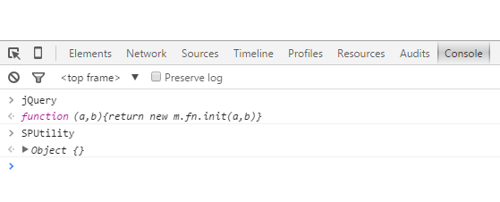

The most common problems people encounter are during installation.

# Check to make sure SPUtility.js and jQuery are being loaded

Any code you write is dependent on the jQuery and SPUtility libraries being loaded on the page. If they aren't, your code won't work and you'll get an error.

Symptoms:
* Uncaught ReferenceError: SPUtility is not defined
* Uncaught ReferenceError: jQuery is not defined

# Navigate to your form. For NewForm.aspx click the New Item button. For EditForm.aspx, create an item in your list and then edit it by clicking the "..." and choosing Edit.
# Press F12 in your browser to bring up the Developer Tools
# Go to the Console tab
# Type in "jQuery"

If it works, you'll get a function returned in the console: function (a,b){return new m.fn.init(a,b)}

Good:

Bad:

# +SharePoint 2013:+ Disable Minimal Download Strategy (MDS)

If you see "/_layouts/15/start.aspx" in the URL of your SharePoint site, it is currently enabled. Before you disable MDS, you need to consider whether or not you need it enabled. Unfortunately, I haven't been able to get SPUtility.js to work with it (if you have a solution let me know!).

What is MDS? Check out [https://msdn.microsoft.com/en-us/library/office/dn456544.aspx](https://msdn.microsoft.com/en-us/library/office/dn456544.aspx)

To disable, go to Site Settings -> Manage Site Features -> Deactivate Minimal Download Strategy. This is a per-site setting so you will need to disable it on any site which you are planning to use SPUtility.js on.